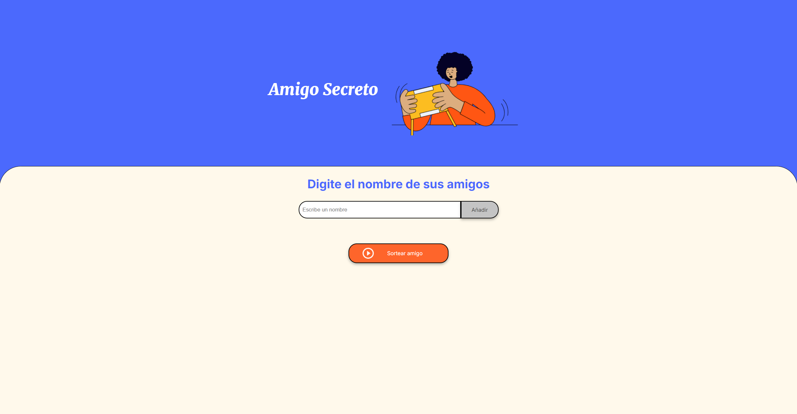

# Amigo Secreto

Este proyecto es una aplicación web para realizar un sorteo de "Amigo Secreto". Permite agregar nombres de amigos a una lista y luego sortear uno de ellos al azar.

## Estructura del Proyecto

El proyecto tiene la siguiente estructura de archivos:

## Archivos

- `index.html`: Contiene la estructura HTML de la aplicación.
- `style.css`: Contiene los estilos CSS para la aplicación.
- `app.js`: Contiene la lógica de JavaScript para la aplicación.
- `assets/`: Carpeta que contiene las imágenes utilizadas en la aplicación.

## Funcionalidades

### Agregar Amigo

Permite agregar nombres de amigos a una lista. Si el campo de texto está vacío o el nombre ya ha sido ingresado, muestra un mensaje de alerta.

### Mostrar Lista de Amigos

Muestra la lista de amigos agregados en la interfaz.

### Sortear Amigo

Realiza un sorteo al azar entre los nombres de la lista y muestra el nombre del amigo sorteado. Si la lista está vacía, muestra un mensaje de alerta.

## Uso

1. Clona el repositorio o descarga los archivos del proyecto.
2. Abre el archivo `index.html` en tu navegador web.
3. Ingresa los nombres de tus amigos en el campo de texto y haz clic en "Añadir".
4. Una vez que hayas agregado todos los nombres, haz clic en "Sortear amigo" para realizar el sorteo.

## Capturas de Pantalla

## Tecnologías Utilizadas

- HTML
- CSS
- JavaScript

## Autor

Miguel Andres MF
